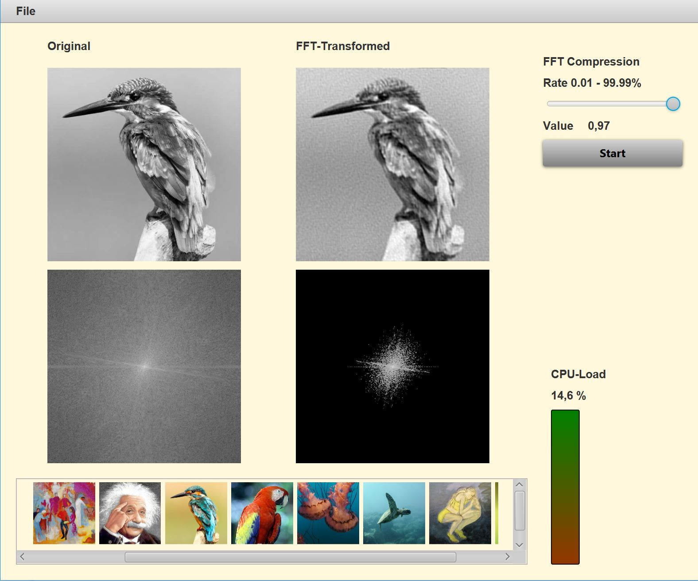

# ImageCompression-CaseStudy

This is a sample application demonstrating the compression of images by applying a two-dimensional Fast Fourier Transformation.

This project is part of a lesson on concurrent programming with Java hold on the **University of Applied Sciences Kaiserslautern**.

The main focus is on the application of parallel streams (data parallelism) and the `CompletableFuture` class (task parallelism).

Note that the application uses nested parallelism. Some asynchronous task use parallel streams. These streams use their own ForkJoinPool. 

Remarks
* The project was build with OpenJDK 11 
* The application uses [oshi](https://github.com/oshi/oshi) (Native Operating System and Hardware Information)
* Dependencies to JavaFX and the oshi libraries are managed by Maven

Main class: `app.SimpleImageCompression`

Build command:

`mvn clean package`

The command create a lib and module directory that contains the dependencies and module runnable.

To start the application:

`java -Xms12g -Xmx16g -p modules;lib -m FFTImageCompression/app.SimpleImageCompression`

---

### The Application

The application offers a simple user interface. You can load a directory with jpg- and png-files. The contents of the directory are shown below on the UI.

The selected image will be transformed to a gray image (upper image on the left column). From the gray image a two-dimensional Fourier Transformation is calculated an the absolute values of the Fourier coefficients are shown in lower image on the left column. The biggest coefficient is colored white, zero valued coefficients are colored black. Colors between are scaled log-gray.

On the right side a compression rate can be selected. Pressing the start button the selected 
percent smallest coefficients of the two-dimensional Fourier Transformation are set to zero. With this truncated image information the image is reconstructed. The reconstructed image an the truncated Fourier matrix are both shown on the left column.

**Remark:** The images should be not too large. A size of max 4096 x 4096 pixels is strongly recommended!  For larger images timeout or out of memory exceptions can occur and can leave the application in an undefined state.

